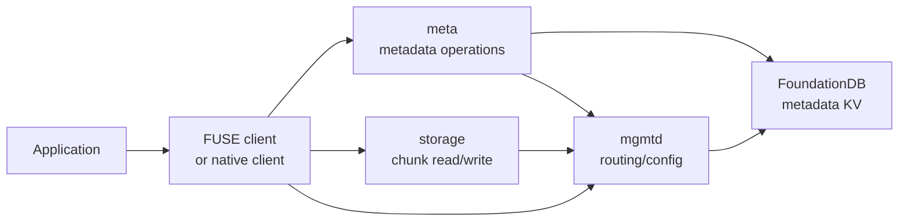

# 3FS Day 1 Reading Guide Answers

> 做完 [docs/day1-reading-guide.md](/data00/home/lujianhui.1/3FS/docs/day1-reading-guide.md:1) 里的阅读任务后再看这份参考产出。

## 阶段产出

### 第一阶段：一句话总结

3FS 是面向 AI 训练和推理负载的高性能分布式文件系统，用 SSD 集群和 RDMA 网络提供强一致、高吞吐的共享存储。

### 第二阶段：四个组件职责和系统关系图

- `mgmtd`：控制面，维护 membership、配置、target 状态、chain table 和 routing info。
- `meta`：元数据服务，负责 inode、目录项、文件布局、session 等文件系统语义，核心状态存放在 FoundationDB。
- `storage`：数据面服务，保存 chunk 数据，通过 chain replication / CRAQ 提供一致性和恢复能力。
- `fuse/client`：访问入口。FUSE client 暴露标准文件系统接口，native client 提供异步 zero-copy IO 路径。



文件读请求通常不是每次都访问 `mgmtd`。客户端先通过 `meta` 拿到文件布局，再结合本地缓存的 routing info 计算 chunk 对应的 chain 和 storage target，然后直接访问 `storage`。

### 第三阶段：最小集群启动顺序

1. 检查二进制、FDB 工具、测试目录和网络地址。
2. 生成 `mgmtd`、`meta`、`storage`、`fuse`、`admin_cli` 配置。
3. 启动 FoundationDB，并执行 `configure new memory single`。
4. 用 `admin_cli` 创建 root 用户和 token。
5. 执行 `init-cluster`，把各服务配置初始化进集群。
6. 启动 `mgmtd_main`。
7. 启动 `storage_main` 和 `meta_main`。
8. 创建 target，上传 chains 和 chain table。
9. 创建测试目录和权限。
10. 启动 `hf3fs_fuse_main`，等待 mountpoint 可用。

## 练习题参考答案

1. 3FS 的四个核心组件分别是什么，各自职责是什么？
   - `mgmtd`：负责整个集群的控制面，维护节点 membership、target 状态、chain table、routing info，以及配置分发。
   - `meta`：负责文件系统元数据，主要包括目录树、inode、目录项、文件布局信息、session 等语义。
   - `storage`：负责文件数据存储，主要保存 chunk 数据，并通过 replication chain 提供一致性和恢复能力。
   - `fuse/client`：负责面向应用提供访问入口。FUSE client 提供文件系统接口，native client 提供高性能 zero-copy IO 路径。

2. 为什么 `meta` 被设计成无状态服务？
   - 因为 `meta` 的核心状态被下沉到事务型 KV，也就是 FoundationDB，所以 `meta` 实例本身不需要长期持有业务状态。
   - 这样做的好处是可以方便地横向扩展，也方便故障切换、重启和升级，客户端也可以连接任意可用的 `meta` 节点。

3. 为什么文件元数据放在事务型 KV，而 chunk 数据不放在那里？
   - 更本质的原因不是“一个小一个大”，而是它们的语义和访问模式不同。元数据操作需要强事务语义，比如 `create`、`rename`、`unlink`、目录项更新、session 管理等，这类操作适合放在事务型 KV 上。
   - chunk 数据的数据量和吞吐量都很大，更适合走独立的数据面，由 `storage` 服务通过 replication chain 来管理，而不是塞进事务型 KV。

4. `mgmtd` 为什么是控制中枢，而不是 `meta`？
   - 因为 `mgmtd` 掌握的是整个集群的全局运行状态，包括节点信息、target 状态、chain table、routing info 和配置版本。
   - `meta` 只负责文件系统语义层的元数据，不负责全局成员管理和数据面路由，所以它不能承担控制中枢的角色。

5. FUSE client 和 native client 的主要差别是什么？
   - FUSE client 提供标准 Linux 文件系统接口，应用接入成本低，可以像访问普通文件系统一样访问 3FS，但性能会受到 FUSE 路径本身的限制。
   - native client 提供异步 zero-copy IO 能力，适合性能敏感场景，尤其是小随机读等场景，性能比传统 FUSE 路径更强。

6. `tests/fuse/run.sh` 为什么先起 FDB，再做 `init-cluster`？
   - 因为 `init-cluster` 需要往底层 KV 写初始化数据，而这个底层 KV 就是 FDB，所以 FDB 必须先可用。
   - 这里要注意，`init-cluster` 主要做的是初始化文件系统根布局，以及写入 `mgmtd`、`meta`、`storage`、`fuse` 的配置。root 用户和 token 不是 `init-cluster` 本身写进去的，而是脚本前面的 `user-add` 和 `user-set-token` 先写进去的。

7. `create-target`、`upload-chains`、`upload-chain-table` 这三步本质上在初始化什么？
   - `create-target`：把实际可用的物理存储目标注册出来，可以理解成把“盘上的可分配坑位”建出来。
   - `upload-chains`：把这些 target 组织成复制链，也就是副本组。
   - `upload-chain-table`：把这些链挂到一个可被文件布局引用的分配表上，供后续文件创建和 chunk 分布使用。

8. 一个应用通过 FUSE 访问 3FS 时，最先接触到的用户态进程是谁？
   - 最先接触到的是 FUSE client daemon，也就是 3FS 的 FUSE 用户态进程。
   - 内核会把文件系统请求转发给它，再由它去继续走元数据路径或数据路径。

9. 一个文件读请求为什么不需要每次都经过 `mgmtd`？
   - 因为 `mgmtd` 主要负责提供和维护 routing info、集群拓扑、chain table 等全局控制信息，而不是处理每次读请求本身。
   - 客户端会缓存 routing info。文件在 `open` 时，client 从 `meta` 拿到文件布局信息，之后就可以根据布局和缓存的 routing info 计算 chunk 所在链路，并直接访问对应的 `storage` 节点。

10. 如果 `meta` 全挂了，和如果 `storage` 全挂了，系统表现会有什么本质区别？
   - 如果 `meta` 全挂了，文件系统语义入口会大面积失效，例如 `lookup/open/create/rename/readdir/chmod` 这些操作都会受影响。不能简单说“还能正常读已有文件”，因为很多读之前也需要先经过 metadata 路径。
   - 如果 `storage` 全挂了，数据面会瘫痪，文件内容无法正常读写；但元数据层本身可能还活着，一些纯命名空间或权限相关操作理论上仍可能工作。两者的本质区别是：一个是语义层不可用，一个是数据面不可用。

## Day 1 笔记模板补全

```md
# Day 1

## 模块职责
- mgmtd: 控制面，维护 membership、config、target 状态、chain table、routing info。
- meta: 元数据服务，处理 inode、目录项、文件布局和 session，状态落在 FDB。
- storage: 数据服务，保存 chunk，通过 chain replication/CRAQ 提供一致性和恢复。
- fuse/client: 应用入口，FUSE 提供文件系统接口，native client 提供高性能 IO API。

## 关键对象/概念
- routing info: 客户端和服务使用的全局路由视图，包含节点、chain、target 状态等。
- chain table: 文件布局选择 chain 的表，是数据放置的一部分。
- inode: 文件系统对象的元数据载体，记录文件/目录属性和布局信息。
- chunk: 文件数据切分后的存储单元，由 storage target 保存。
- native client: 绕过 FUSE 路径的高性能客户端接口，支持异步 zero-copy IO。

## 主调用链
- 启动链路: FDB -> init-cluster -> mgmtd -> storage/meta -> targets/chains/chain table -> fuse。
- 文件读请求链路: app -> fuse/client -> meta 获取布局 -> client 用 routing info 定位 storage -> storage 返回 chunk。

## 还不清楚的问题
- Q1: CRAQ 的 pending/committed version 如何在代码中落地？
- Q2: client routing info 的刷新周期和失败重试在哪里实现？
- Q3: 文件布局如何从 meta 写入并在读路径被 client 使用？
```
