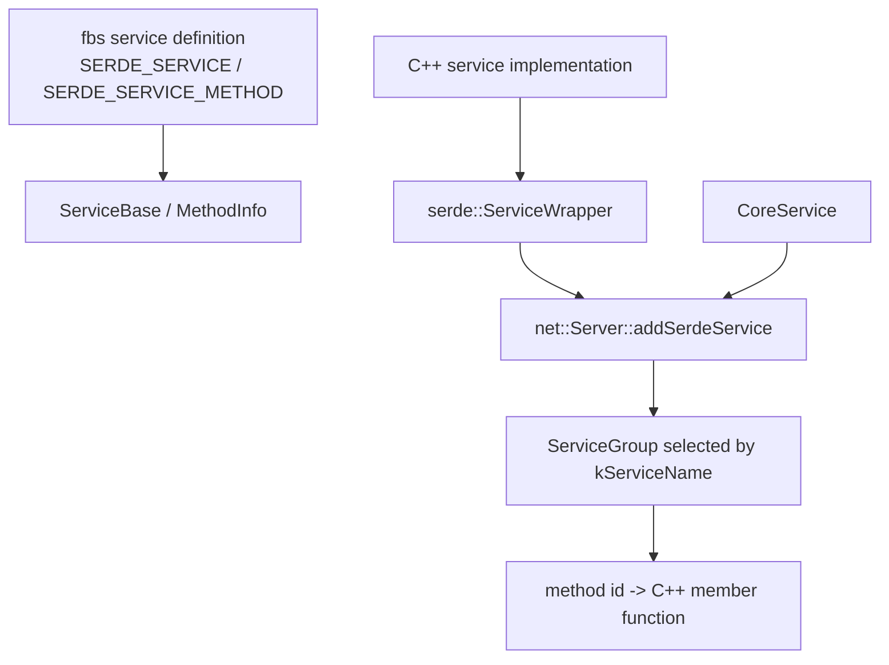

# 3FS Day 2 Reading Guide Answers

> 做完 [docs/day2-reading-guide.md](/data00/home/lujianhui.1/3FS/docs/day2-reading-guide.md:1) 里的阅读任务后再看这份参考产出。

## 阶段产出

### 第一阶段：服务启动主骨架

```text
main
  -> TwoPhaseApplication<Server>().run(argc, argv)
    -> launcher.parseFlags(...)
    -> ApplicationBase.parseFlags("--config.", ...)
    -> launcher.init()
      -> load app_cfg
      -> load launcher_cfg
      -> start IBManager
      -> create RemoteConfigFetcher
    -> launcher.loadAppInfo()
      -> build basic AppInfo from node_id and cluster_id
      -> fetcher completes host/service info
    -> launcher.loadConfigTemplate()
      -> fetch service config template by NodeType
    -> init common components
      -> logging / monitoring / memory config
    -> create Server(config.server)
    -> server.setup()
      -> setup each ServiceGroup
    -> launcher.startServer(server, appInfo)
      -> server.start(appInfo)
        -> beforeStart()
        -> start each ServiceGroup
        -> afterStart()
```

一个服务被统一包装成 `Server` 类型，再由 `TwoPhaseApplication<Server>` 驱动完整生命周期。具体服务只需要提供 `kName`、`kNodeType`、`Config`、`AppConfig`、`LauncherConfig`、`RemoteConfigFetcher`、`Launcher`，以及 `beforeStart` 里注册哪些 RPC service。

### 第二阶段：Launcher / Server 分工

`ServerLauncher` 负责启动前的“外部依赖和配置准备”：解析 `app_cfg` 和 `launcher_cfg`，启动 IB 设备管理，构造远端配置拉取器，生成 `AppInfo`，并按服务的 `kNodeType` 拉取配置模板。它知道如何把一个进程接入集群，但不实现业务 RPC。

`net::Server` 负责进程内 RPC 容器：根据 `net::Server::Config` 创建线程池和多个 `ServiceGroup`，把 serde service 按服务名挂到对应 group，执行 setup/start/stop，并在 `beforeStart`、`afterStart`、`beforeStop`、`afterStop` 给具体服务插入生命周期逻辑。

三类配置的角色是：

- `app_cfg`：本进程身份配置，例如 `node_id`。
- `launcher_cfg`：启动器配置，例如 `cluster_id`、IB 设备和 mgmtd client，用于连接管理面并拉取远端配置。
- `cfg`：服务运行配置，即 `TwoPhaseApplication::Config { common, server }`；`common` 管日志、监控、内存等公共配置，`server` 管网络服务和业务配置。

### 第三阶段：RPC 挂载方式



`serde::ServiceWrapper` 把 C++ 实现类和 fbs/serde 服务描述绑定起来，暴露 `kServiceName` 和 `kServiceID`，并让反射机制收集 method id 到成员函数的映射。`net::Server::addSerdeService` 根据 service name 找到配置中的 `ServiceGroup`，把服务对象挂进去。

很多服务会同时挂业务 service 和 `CoreService`。业务 service 处理自己的 RPC，`CoreService` 提供 echo、配置渲染、热更新、shutdown 等通用管理入口，常被放到独立 TCP group 和独立线程池里，避免管理面被业务流量拖住。

## 练习题参考答案

> 注：Day 2 guide 的“进入 Day 3 前的门槛”写的是 8 道练习题，但“今日练习题”实际列出 7 道；这里按列出的 7 道回答。

1. `TwoPhaseApplication` 解决了什么问题，为什么服务都复用它？
   - `TwoPhaseApplication` 解决的是服务进程启动流程重复的问题：解析配置、初始化 launcher、加载 AppInfo、加载配置模板、初始化公共组件、创建 server、setup、start、stop。每个服务如果都手写这套流程，很容易出现配置顺序、日志初始化或停止流程不一致。
   - 服务复用它后，只需要提供自己的 `Server` 类型和配置类型。公共生命周期由模板统一驱动，具体服务把差异集中在 `Server::Config` 和 `beforeStart` 之类的 hook 里。

2. `ServerLauncher` 负责的是服务生命周期的哪一段？
   - `ServerLauncher` 负责 server 真正启动前后的 bootstrap 阶段，不负责业务 RPC 的具体实现。它加载 `app_cfg` 和 `launcher_cfg`，启动 IBManager，创建 `RemoteConfigFetcher`，再通过 fetcher 获取配置模板、补全 `AppInfo`。
   - 启动 server 时，它调用 `fetcher_->startServer(server, appInfo)` 或默认的 `server.start(appInfo)`。所以它是“接入集群和准备配置”的层，而不是网络 RPC 容器层。

3. `app_cfg`、`launcher_cfg`、`cfg` 这几类配置，角色分别是什么？
   - `app_cfg` 是单进程自身身份配置，典型字段是 `node_id`，用于构造基础 `AppInfo`。`launcher_cfg` 是启动器配置，包含 `cluster_id`、IB 设备、mgmtd client 等，用来连接管理面并拉取远端配置。
   - `cfg` 是服务运行配置，也就是 `TwoPhaseApplication::Config { common, server }`。其中 `common` 管日志、监控、内存等公共组件，`server` 管 `net::Server::Config` 和服务自己的业务配置。

4. `net::Server::Config` 中的 `groups` 是干什么的？
   - `groups` 是 service group 列表，每个 group 对应一套 `ServiceGroup::Config`：服务名集合、网络类型、listener、IO worker、processor，以及是否使用独立线程池。`net::Server` 构造时会按 `groups_length()` 创建多个 `ServiceGroup`。
   - `setup`、`start`、`stop` 都是逐 group 执行的，`addSerdeService` 也会根据 service name 找到对应 group。因此 group 是 RPC 服务挂载、监听地址和线程资源隔离的基本单元。

5. 为什么很多服务都把业务 RPC 和 `Core` service 分在两个 group 里？
   - 业务 RPC 和 `CoreService` 分 group，是为了把业务流量和管理入口隔开。业务服务可以走高性能网络和主线程池，`CoreService` 可以走 TCP 和独立线程池，用于 echo、配置、热更新、shutdown 等管理操作。
   - 这样业务流量拥塞或线程池压力过大时，管理入口仍有机会响应。它也让服务发现信息里能清楚区分不同服务名和监听地址。

6. `serde::ServiceWrapper` 在这个项目中的作用是什么？
   - `serde::ServiceWrapper` 是服务实现类和 generated/declared service 描述之间的桥。它从 fbs service base 暴露 `kServiceName` 和 `kServiceID`，让 `Server::addSerdeService` 可以按服务名挂载，让 dispatch 层可以按 service id 查找。
   - 它还通过反射接口把 `SERDE_SERVICE_METHOD` 生成的 method 元信息交给 `MethodExtractor`。最终 method id 会映射到具体 C++ 成员函数，例如某个 `echo(ctx, req)`。

7. 如果你新加一个服务，最小需要补哪些类型定义和入口？
   - 最小需要补请求/响应结构和 `SERDE_SERVICE` / `SERDE_SERVICE_METHOD` 定义，再写一个业务 service 类继承 `serde::ServiceWrapper<Impl, ServiceBase>` 并实现对应 RPC 方法。否则没有服务名、服务 id、方法 id，也没有请求/响应类型。
   - 还需要一个派生自 `net::Server` 的 server 类型，定义 `kName`、`kNodeType`、`CommonConfig`、`AppConfig`、`LauncherConfig`、`RemoteConfigFetcher`、`Launcher`、`Config`，并在 `beforeStart` 里 `addSerdeService`。最后补一个 `main` 用 `TwoPhaseApplication<YourServer>().run(argc, argv)`，再接入 CMake。

## Day 2 笔记模板补全

```md
# Day 2

## 启动骨架
- main: 只实例化 TwoPhaseApplication<Server> 并调用 run。
- TwoPhaseApplication: 统一解析配置、初始化公共组件、创建并启动 Server。
- ServerLauncher: 准备 app/launcher 配置、AppInfo、远端配置模板和启动入口。
- net::Server: 管线程池、ServiceGroup、RPC service 注册和 start/stop hook。

## 关键概念
- app_cfg: 本进程身份配置，核心是 node_id。
- launcher_cfg: 接入集群和拉配置所需的启动器配置。
- cfg: common + server 的完整运行配置。
- groups: service group 列表，决定服务名、监听地址、网络类型和线程池隔离。
- CoreService: 通用管理 RPC service，通常和业务 service 一起挂载。

## 主调用链
- 服务启动链: main -> TwoPhaseApplication -> launcher.init -> load AppInfo/config -> server.setup -> server.start。
- RPC 挂载链: fbs service -> ServiceWrapper -> addSerdeService -> ServiceGroup -> method dispatch。

## 还不清楚的问题
- Q1: ServiceGroup 内部如何把网络包 dispatch 到 MethodExtractor？
- Q2: RemoteConfigFetcher 针对 mgmtd/meta/storage 有哪些差异？
- Q3: CoreService 的热更新配置如何安全地作用到运行中服务？
```
