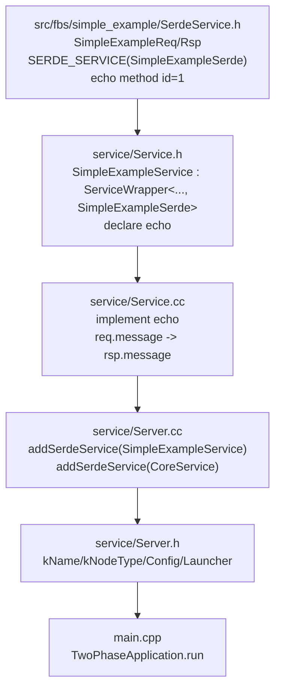

# 3FS Day 3 Reading Guide Answers

> 做完 [docs/day3-reading-guide.md](/data00/home/lujianhui.1/3FS/docs/day3-reading-guide.md:1) 里的阅读任务后再看这份参考产出。

## 阶段产出

### 第一阶段：最小服务入口结构

`simple_example` 的入口非常薄：`src/simple_example/main.cpp` 只 include `TwoPhaseApplication.h`、内存 override 和自己的 `SimpleExampleServer`，然后执行 `TwoPhaseApplication<simple_example::server::SimpleExampleServer>().run(argc, argv)`。这说明 3FS 服务进程的入口不直接处理配置、网络、RPC 注册或业务逻辑，而是把这些都交给统一应用框架和 Server 类型。

`src/simple_example/README.md` 的价值是告诉你新增服务时要复制两部分：`src/simple_example` 里的 C++ 服务骨架，以及 `src/fbs/simple_example` 里的 RPC schema。也就是说，一个最小服务从一开始就分成“进程/服务实现”和“协议定义”两条线。

### 第二阶段：Server 类职责

`SimpleExampleServer` 是进程内的服务容器层。它继承 `net::Server`，定义服务名 `kName = "SimpleExample"`、节点类型 `kNodeType = CLIENT`、公共配置、启动器配置、远端配置拉取器、launcher 类型，以及真正的运行配置。

它的 `Config` 里配置了两个 service group：一个挂 `SimpleExampleSerde`，一个挂 `Core`，后者走 TCP 和独立线程池。`beforeStart()` 负责启动 background client、创建 mgmtd client、刷新 routing info、创建 storage client，并把 `SimpleExampleService` 和 `CoreService` 注册进 `net::Server`；`beforeStop()` 则停止 mgmtd client 和 background client。

Server 类不实现具体 `echo` 业务逻辑。它负责进程级依赖、配置、生命周期和 RPC service 装配。

### 第三阶段：schema -> service -> server -> main 映射



对应关系可以简化成一句话：fbs/schema 决定 RPC 协议面，C++ service 决定方法实现，Server 决定服务如何被挂载和启动，main 决定这个进程使用哪个 Server 模板实例。

## 练习题参考答案

1. `simple_example` 的存在价值是什么？
   - `simple_example` 是 3FS 新服务的最小模板，用来展示一个服务从进程入口、Server、业务 RPC Service 到 fbs schema 的完整闭环。它的业务逻辑很少，`echo` 只是把请求里的 message 原样返回，所以重点不是业务，而是学习服务骨架和命名约定。
   - 读懂它以后，再看 `mgmtd`、`meta`、`storage` 时就可以按同一套结构拆解：先找 main，再找 Server，再找 Service/schema，最后看业务 operation。

2. `SimpleExampleServer` 和 `SimpleExampleService` 分别代表什么层级？
   - `SimpleExampleServer` 是进程内的服务容器层，继承 `net::Server`，负责服务名、节点类型、配置、监听 group、mgmtd client、storage client，以及启动/停止生命周期。它在 `beforeStart()` 中注册 `SimpleExampleService` 和 `CoreService`。
   - `SimpleExampleService` 是业务 RPC 实现层，继承 `serde::ServiceWrapper<SimpleExampleService, SimpleExampleSerde>`，表示“我实现了 fbs 中声明的 `SimpleExampleSerde` 服务”。它不管端口、线程池、进程启动和配置加载，只声明并实现具体 RPC 方法。

3. 业务 service 为什么不直接等于进程入口类？
   - 进程入口类负责应用生命周期：解析参数、加载 app/config、初始化公共组件、构造 Server、启动 Server，这些由 `TwoPhaseApplication<SimpleExampleServer>` 完成。业务 service 只应该处理 RPC 请求，否则一个 `echo` 方法实现会被迫知道配置来源、mgmtd、线程池、监听端口、停止流程等进程级细节。
   - 另外，一个进程通常不只暴露一个业务 service。`SimpleExampleServer` 同时注册了 `SimpleExampleService` 和 `CoreService`，说明 Server 是多个 RPC service 的宿主，而不是某一个业务方法集合本身。

4. `src/fbs/simple_example` 中的定义和 `service/Service.h` 是怎样对应的？
   - `src/fbs/simple_example/SerdeService.h` 定义协议面：`SimpleExampleReq`、`SimpleExampleRsp`，以及 `SERDE_SERVICE(SimpleExampleSerde, 0xF0)` 下的 `echo` 方法，方法 id 是 1，请求/响应类型分别是 `SimpleExampleReq` 和 `SimpleExampleRsp`。
   - `service/Service.h` 引入这个 schema，然后让 `SimpleExampleService` 继承 `ServiceWrapper<SimpleExampleService, SimpleExampleSerde>`，并声明同名、同类型的 `echo` 方法。fbs 侧决定“服务叫什么、有哪些 RPC、类型是什么”，C++ Service 侧决定“这些 RPC 怎么执行”。

5. 为什么新增一个服务不只是复制 `src/simple_example`，还要补 `src/fbs/simple_example` 对应部分？
   - 因为 C++ 业务代码只是实现端，fbs/serde 定义才是 RPC 协议入口。没有对应的 fbs 定义，就没有请求/响应结构、服务名、服务 id、方法 id，也无法绑定客户端调用、服务注册和反射信息。
   - `Service.h` 直接依赖 `fbs/simple_example/SerdeService.h` 里的 `SimpleExampleSerde`、`SimpleExampleReq`、`SimpleExampleRsp`。所以新增服务时必须同时补 `src/<service>` 和 `src/fbs/<service>`。

6. `kNodeType` 在系统中可能被哪些逻辑使用？
   - `kNodeType` 会被 `ServerLauncher` 从 `Server::kNodeType` 取出，用来向 mgmtd 拉取对应节点类型的配置模板。正式服务里 mgmtd/meta/storage 会分别设置成不同的 NodeType，`simple_example` 暂时使用 `CLIENT`。
   - 它还会影响节点注册、心跳、路由筛选、配置管理和管理命令。因为 `NodeInfo` 中会保存 type 字段，控制面和客户端可以按节点类型区分服务。

7. 如果你要快速看懂一个新服务，先读哪 3 个文件最划算？
   - 第一读 `main.cpp`，看进程入口启动的是哪个 Server 类型。第二读 `service/Server.h`，看 `kName`、`kNodeType`、Config、监听服务名、Launcher 和依赖组件。
   - 第三读业务 `service/Service.h` 或对应的 fbs service 定义；如果只能选 3 个，我会选 `main.cpp`、`service/Server.h`、`src/fbs/<service>/...Service.h`。读完这三个，再去 `Service.cc` 看方法实现，基本就能把“进程入口 -> Server 容器 -> RPC 协议 -> 业务实现”的关系串起来。

## Day 3 笔记模板补全

```md
# Day 3

## 模板角色
- main: 选择具体 Server 类型，并交给 TwoPhaseApplication 运行。
- Server: 进程级容器，定义配置、service groups、依赖初始化和 service 注册。
- Service: RPC 实现类，绑定 fbs service base 并实现具体方法。
- schema: RPC 协议定义，包含请求/响应类型、服务名、服务 id 和方法 id。

## 关键概念
- kName: 服务进程名，用于日志、公共组件初始化等。
- kNodeType: 节点类型，用于拉配置、注册、心跳和路由分类。
- Config: 服务运行配置，通常包含 net::Server::Config 和业务依赖配置。
- Launcher: 负责 app/launcher 配置、AppInfo、远端配置模板和 server 启动。

## 映射关系
- schema -> Service: ServiceWrapper 把 C++ 实现绑定到 fbs service 描述。
- Service -> Server: Server 在 beforeStart 中 addSerdeService 注册业务 service。
- Server -> main: main 使用 TwoPhaseApplication<Server> 运行整个进程。

## 还不清楚的问题
- Q1: simple_example 创建的 StorageClient 在 echo 示例中没有使用，正式服务如何使用它？
- Q2: service group 的 processor 如何调用到 ServiceWrapper 收集的方法？
- Q3: 新增服务时 service id 和 method id 如何避免冲突？
```
