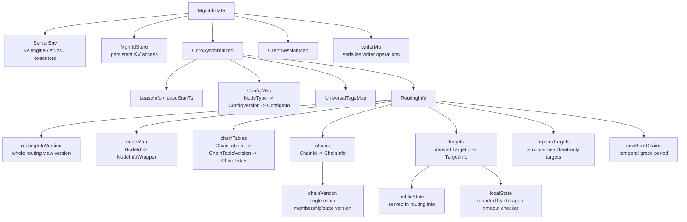
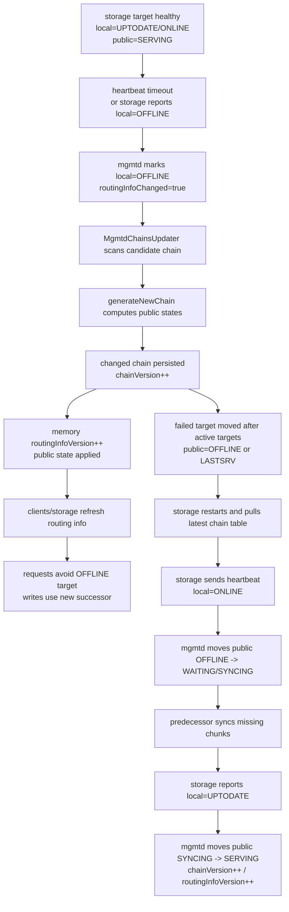

# 3FS Day 4 Reading Guide Answers

> 做完 [docs/day4-reading-guide.md](/data00/home/lujianhui.1/3FS/docs/day4-reading-guide.md:1) 里的阅读任务后再看这份参考产出。

## 阶段产出

### 第一阶段：mgmtd 职责边界

`mgmtd` 是 3FS 的控制面服务，不在普通读写数据路径上直接搬运文件内容。它负责维护集群成员信息、节点心跳状态、配置版本、chain table、chain target 的 public/local 状态，以及对客户端和其他服务可见的 routing info。

从入口看，`src/mgmtd/mgmtd.cpp` 只把进程交给 `TwoPhaseApplication<MgmtdServer>`；`MgmtdServer` 再创建 `MgmtdOperator`，注册 `MgmtdService` 和 `CoreService`，并启动后台任务。RPC 方法本身通过 `MgmtdOperator` 转成具体 `mgmtd/ops/*Operation`，所以职责分层是：server 管生命周期和服务注册，operator 管 RPC 到 operation 的分发，operation/background task 管具体控制面状态修改。

`mgmtd` 的边界可以概括为：

- membership：登记节点，接收心跳，判断节点是否 heartbeat failed 或 disabled。
- target 状态：接收 storage 上报的 local target state，周期性计算 public target state。
- chain table：保存 chain 和 chain table，发生 target 状态变化时提升 chain version。
- routing info：把节点、chain table、chain、target 状态打包成带版本的全局路由视图，供客户端和服务刷新。
- config：保存并分发不同节点类型的配置版本。
- 不负责：文件 namespace 语义、chunk 数据读写、chunk 副本同步的实际数据传输。

### 第二阶段：核心状态对象关系图



`chain version` 是单条 chain 的版本，只有该 chain 的 target 顺序或 public state 变化时才递增，storage 写请求会用它判断自己看到的链路是否过期。`target state` 是单个 target 的状态，其中 public state 会进入 chain/routing info 影响客户端和 storage 选路，local state 来自 storage 心跳或 heartbeat timeout，是 mgmtd 计算 public state 的触发输入。`routing info version` 是整个路由视图的版本，只要节点、chain table、chain、target 等对外可见信息发生变化，就会提升，客户端用它判断是否需要刷新全局路由信息。

### 第三阶段：target 故障和恢复状态流转图



典型故障路径是：storage 停止心跳，或者心跳里上报某个 local target offline；primary `mgmtd` 的 `MgmtdHeartbeatChecker` 把节点或 target 标为失败；`MgmtdChainsUpdater` 根据 local state 调用 `generateNewChain` 重新计算 public state 和 target 顺序；变化被写入 KV 并提升 chain version、routing info version；客户端和 storage 后续刷新 routing info 后使用新链路。

恢复路径是：返回的 storage 先拉取最新 chain table，确认自己的 target 已被 mgmtd 标为 offline 后再重新参与；它通过心跳报告 local online，mgmtd 通常先把它放入 waiting/syncing，而不是直接 serving；前驱负责把缺失或过期 chunk 同步给它；同步完成后 storage 报告 local up-to-date，mgmtd 再把 public state 推回 serving。

## 练习题参考答案

1. `mgmtd` 维护的核心状态对象有哪些？
   - 核心入口是 `MgmtdState`，它持有 `MgmtdData`、`MgmtdStore`、`UserStoreEx`、当前节点信息、配置引用以及写操作互斥锁。`MgmtdData` 里面又包含 `RoutingInfo`、配置版本表、lease、universal tags 和 routing info cache。
   - `RoutingInfo` 是控制面最重要的路由视图，包含 node map、chain tables、chains、derived targets、routing info version，以及 orphan/newborn 这类临时状态。

2. 心跳在 3FS 里除了“保活”还有什么作用？
   - 心跳会携带节点类型、配置版本、配置状态、heartbeat version 等信息，`mgmtd` 用它更新 membership 状态，并判断是否需要给节点返回更新后的配置。对 storage 节点来说，心跳还携带 local target state、chain version、磁盘索引和使用量等 target 信息。
   - 因此心跳不仅是 liveness 信号，也是 target local state 上报通道。target 的 local state 变化会触发 mgmtd 后台任务重新计算 public state、chain version 和 routing info version。

3. `RoutingInfo` 为什么必须被客户端周期性刷新？
   - 客户端读写 chunk 时需要知道 chain table、chain 成员、target public state 和 storage 节点地址，这些信息都会随着节点故障、恢复、扩容、配置变更而变化。客户端如果长期使用旧 routing info，就可能把请求发到已经 offline 的 target，或者使用过期 chain version 被 storage 拒绝。
   - 3FS 的正常数据路径不希望每次 IO 都经过 `mgmtd`，所以客户端本地缓存 routing info。周期性刷新是把控制面变化传播到客户端的机制，保证客户端在不打扰每次 IO 的情况下最终看到新路由。

4. chain table 和 routing info 是同一件事吗？
   - 不是。chain table 是数据放置表，描述某个表版本里有哪些 chain 可供文件布局选择，meta 创建文件布局时会依赖它。
   - routing info 是更大的全局路由视图，除了 chain table，还包含节点信息、chain 当前版本、target public/local 状态等。客户端真正选 storage 请求路径时需要的是 routing info，而不只是 chain table。

5. target 的 public state 和 local state 有什么区别？
   - public state 是对客户端和服务公开的状态，进入 chain/routing info，决定 target 是否参与读、是否接收写传播，以及它在 chain 中的位置。它包括 `SERVING`、`LASTSRV`、`SYNCING`、`WAITING`、`OFFLINE` 等状态。
   - local state 是 storage 本地或 mgmtd timeout 观察到的状态，只在 storage 和 mgmtd 之间使用，主要包括 `UPTODATE`、`ONLINE`、`OFFLINE`。mgmtd 用 local state 作为输入，周期性计算 public state，因此 local state 更像事实/事件，public state 更像对外协议状态。

6. 为什么 target 出故障后会被移到链尾？
   - chain replication 的写入要沿链路向后传播，故障 target 如果留在中间，会阻断它后面的副本继续接收写请求。把 offline target 移到链尾后，仍然健康的 target 可以组成新的有效前缀，写请求可以继续从 head 向新的 successor 传播。
   - 这也让恢复过程更清晰：返回的 target 作为尾部附近的 waiting/syncing 副本，从前驱补齐数据，补齐后再切回 serving。

7. 一个 storage 节点故障后，谁负责检测、谁负责改链、谁负责广播？
   - primary `mgmtd` 负责检测。它通过 `HeartbeatOperation` 接收心跳上报，也通过 `MgmtdHeartbeatChecker` 周期性检查超时节点和 target，把节点标成 `HEARTBEAT_FAILED`，或把 target local state 标成 `OFFLINE`。
   - primary `mgmtd` 也负责改链。`MgmtdChainsUpdater` 扫描发生变化的 target，调用 `appendChangedChains` 和 `generateNewChain` 生成新 chain，写入 KV 并更新内存 routing info。这里没有逐个主动推送给所有客户端的广播通道，传播方式是提升 routing info version，客户端和服务通过周期性 `getRoutingInfo` 刷新拿到新视图。

8. 为什么 `mgmtd` 的后台任务拆成多个 checker/updater，而不是一个大循环？
   - 这些后台任务的触发周期、职责和失败处理不同：lease extender 维护 primary lease，heartbeat checker 处理超时，chains updater 计算 chain 状态，routing info version updater 推进路由版本，target info loader/persister 同步 target 位置信息，metrics updater 负责指标。拆开后每个任务可以用独立 interval、独立日志和独立错误处理。
   - 如果合成一个大循环，任何一个慢操作或失败分支都更容易影响其他控制面职责，也会让状态修改顺序和排查路径变复杂。现在的设计用 `MgmtdState` 的 writer mutex 串行化真正的写操作，同时让后台任务在调度和职责上保持分离。

## Day 4 笔记模板补全

```md
# Day 4

## 控制面职责
- membership: 注册节点、接收心跳、维护 NodeStatus、处理 disabled/heartbeat failed。
- chain table: 保存 chain table 和 chain 信息，target 状态变化时更新 chain version。
- routing info: 聚合 node、chain table、chain、target 状态，使用 routingInfoVersion 向客户端传播变化。
- config: 保存各 NodeType 的配置版本，并在心跳响应中分发更新。

## 核心状态对象
- MgmtdState: mgmtd 运行时总状态，持有 env、store、user store、MgmtdData、client sessions 和 writer mutex。
- RoutingInfo: 全局路由视图，维护 nodes、chain tables、chains、targets、routingInfoVersion 和临时 orphan/newborn 状态。
- target public state: 对外可见，决定 target 是否参与服务和链路传播。
- target local state: storage 心跳或 mgmtd timeout 得到的本地状态，是 public state 计算输入。

## 主状态流转
- 心跳 -> 状态更新: storage heartbeat 上报 local target state，mgmtd 更新 node/target 信息并标记 routingInfoChanged。
- 故障 -> 改链 -> 广播: heartbeat timeout/local offline -> generateNewChain -> chainVersion++ -> routingInfoVersion++ -> client/storage refresh。

## 还不清楚的问题
- Q1: generateNewChain 的 LASTSRV 场景需要结合具体写入失败路径再读一遍。
- Q2: storage 同步完成后如何确保所有 chunk 都补齐，需要继续读 storage recovery 代码。
- Q3: routing info refresh 的客户端周期和失败重试策略，需要在 client/mgmtd 与 storage client 里继续确认。
```
