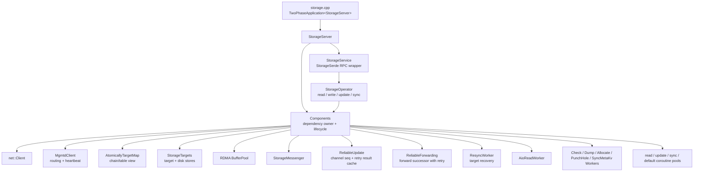
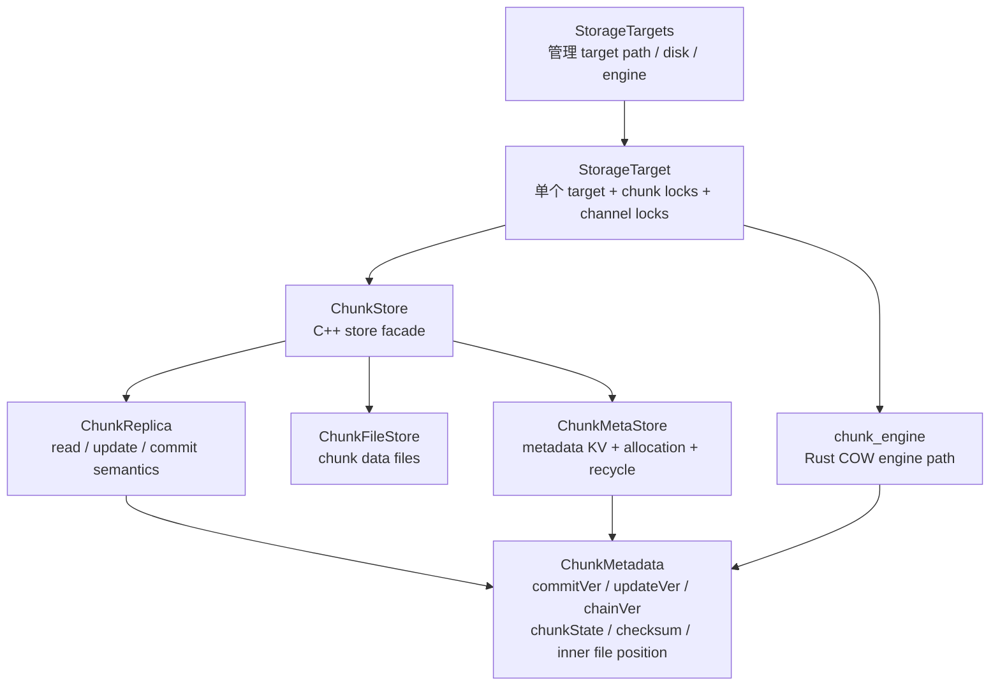
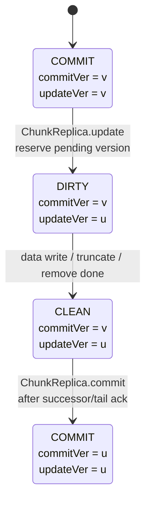
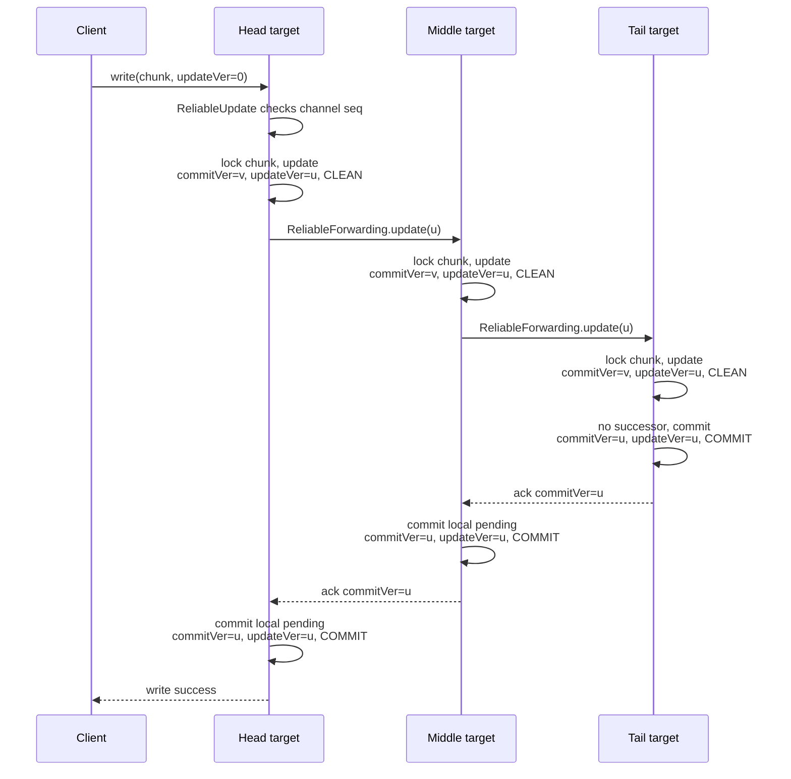

# 3FS Day 6 Reading Guide Answers

> 做完 [docs/day6-reading-guide.md](/data00/home/lujianhui.1/3FS/docs/day6-reading-guide.md:1) 里的阅读任务后再看这份参考产出。

## 阶段产出

### 第一阶段：`storage` 装配图

`storage` 进程入口很薄，真正的服务装配和生命周期编排集中在 `Components`。`StorageServer` 负责把 `StorageService`、`CoreService` 注册到 server，并在启动/停止钩子里调用 `Components`；`StorageService` 再把 RPC 请求转给 `StorageOperator`。



从调用方向看，`StorageOperator` 是主业务入口，但它不拥有底层资源。它通过 `Components` 访问 target、worker、转发器、mgmtd routing、buffer pool 和协程池，所以 `Components` 才是 storage 服务真正的装配中心。

### 第二阶段：chunk 版本与存储结构关系图

一个 chunk 的权威状态落在 `ChunkMetadata` 里。读路径主要看 `commitVer/updateVer` 是否一致；写路径先把 `updateVer` 推进成 pending，再等后继节点确认后把 `commitVer` 推进到同一个版本。



版本状态可以按下面理解：



`ChunkStore` 是旧 C++ 存储路径的门面，组合数据文件和元数据 KV；`ChunkMetaStore` 负责元数据持久化、分配、回收和遍历；`ChunkReplica` 负责单个 chunk 的读、更新、提交规则。Rust `chunk_engine` 对应的是更底层的物理位置分配、copy-on-write 更新、元数据原子持久化和并发读写安全问题。

### 第三阶段：head -> tail -> ack 状态图

CRAQ 写入的关键点是：client 只能从 head 写入，更新沿链向 tail 转发；tail 把 pending 版本提交后，ack 沿调用链回传，前驱节点再把自己的 pending 版本提交。



读路径没有实现原始 CRAQ 论文里的“遇到 pending 就询问 tail”。当前实现中，如果 `commitVer != updateVer` 且请求没有 `ALLOW_READ_UNCOMMITTED`，`ChunkReplica::aioPrepareRead` 返回 `kChunkNotCommit`，让上层重试或由客户端选择放宽读取语义。

恢复路径的核心是 `ResyncWorker`：前驱发现后继处于 syncing 后，先向后继发 `syncStart` 拿到远端 chunk metadata，再和本地 metadata 比较，最后用 full-chunk-replace 的 update 把需要修复的 chunk 转发过去，结束时发送 `syncDone`。

## 练习题参考答案

1. `StorageServer` 真正的“装配中心”为什么是 `Components`？
   - `StorageServer` 本身只持有一个 `Components`，并负责注册 serde service、core service 以及调用启动/停止钩子。它不直接管理 target、mgmtd、buffer pool、worker 或 CRAQ 转发逻辑。
   - `Components` 才拥有这些长期对象，并决定它们的构造顺序、启动顺序和关闭顺序。`StorageOperator` 执行业务时也通过 `Components` 拿到这些依赖，所以真正的装配中心是 `Components`。

2. committed version 和 pending version 分别代表什么？
   - committed version 对应 `commitVer`，表示这个 chunk 已经完成链式提交、可以被普通读请求安全读取的版本。当 `commitVer == updateVer` 且 `chunkState == COMMIT` 时，本地副本没有未提交更新。
   - pending version 对应 `updateVer` 已经领先于 `commitVer` 的状态，表示本地已经接收并写入了一个新版本，但还没有收到后继或 tail 的提交确认。写入过程中会经过 `DIRTY` 和 `CLEAN`，最后 ack 回来后才把 `commitVer` 推到 `updateVer`。

3. 为什么写操作必须在链头串行化？
   - 链式复制要求所有副本按同一个顺序看到更新，否则不同节点可能对同一个 chunk 产生不同的 `updateVer` 序列。head 是唯一入口，可以把客户端并发写收敛成一条有序的更新流，再沿 head 到 tail 传播。
   - 代码里也体现了这个约束：来自 client 的写如果打到非 head，会被 `StorageOperator::handleUpdate` 拒绝；同时 `ReliableUpdate` 按 channel/seq 处理重复和乱序，`StorageTarget` 还会对 chunk 加锁。没有这些串行化约束，tail 的提交顺序和前驱的 pending 状态就无法可靠对齐。

4. 为什么 tail commit 之后还要 ack 回传？
   - tail commit 只说明这次更新已经到达链尾并在链尾变成 committed，但 head 和中间节点此时仍然只是 pending 状态。ack 回传的作用是通知每个前驱可以把自己的 `commitVer` 推进到这次 `updateVer`。
   - 客户端也需要等 head 收到 ack 并完成本地 commit 后才能得到成功响应。否则 head 可能还停留在 `commitVer < updateVer`，普通读会看到未提交状态，失败恢复时也难以判断这次更新是否已经完成链式提交。

5. 读请求遇到 pending version 时，为什么实现上没有直接去 tail 查版本？
   - 直接查 tail 会把普通读路径变成跨节点 RPC，并且要处理 routing 变化、tail 不可达、读写并发和超时语义，复杂度和尾部热点都会上升。3FS 的实现选择让本地副本在发现 `commitVer != updateVer` 时返回 `kChunkNotCommit`。
   - 这样读路径保持简单：普通读只读已提交版本，遇到 pending 就由上层重试；如果调用方明确允许，也可以通过 `ALLOW_READ_UNCOMMITTED` 读取未提交数据。这是对 CRAQ 论文语义的一种工程取舍。

6. `ReliableForwarding` 解决的是哪类失败场景？
   - 它解决的是更新向 successor 转发时遇到的失败或拓扑变化，包括 successor 超时、掉线、routing 版本不一致、目标状态处于 syncing 等场景。它会重新读取 target/chain 信息并重试，直到后继接受，或者当前节点已经变成 tail。
   - 当后继处于 syncing 时，它还会把普通的部分写扩展成 full-chunk-replace 写，保证恢复中的副本能拿到完整 chunk 内容。这让正常写路径和恢复路径可以复用同一套可靠转发机制。

7. target 恢复时，为什么需要 `dump-chunkmeta` 和数据同步两个阶段？
   - `dump-chunkmeta` 阶段先拿到后继 target 上已有 chunk 的元数据快照，再和本地元数据逐项比较。只有先比较 `chainVer`、`commitVer`、`updateVer`、checksum 和 chunk 是否存在，前驱才能知道哪些 chunk 需要传输、哪些需要删除、哪些可以跳过。
   - 数据同步阶段才真正发送 full-chunk-replace 或 remove update。把元数据比较和数据传输拆开，可以避免盲目复制整个 target，也能在大量 chunk 场景下把同步范围收敛到差异集合。

8. `ChunkStore`、`ChunkMetaStore`、`ChunkReplica` 的职责分别是什么？
   - `ChunkStore` 是旧 C++ chunk 存储路径的组合门面，向上提供 get/create/query/remove/sync 等接口，向下组合 `ChunkFileStore` 和 `ChunkMetaStore`。它还维护 chunk 信息缓存，并把具体读写语义交给 `ChunkReplica`。
   - `ChunkMetaStore` 负责元数据 KV、chunk 分配位置、回收状态、uncommitted 列表和 metadata iterator。`ChunkReplica` 不管理全局存储，它定义单个 chunk 在 read、update、commit 时如何检查版本、修改 `ChunkMetadata`、写数据和推进状态。

9. Rust `chunk_engine` 的设计说明，跟 C++ storage 层的哪个问题域最相关？
   - 它最相关的是 chunk 底层存储引擎问题域：物理空间分配、元数据持久化、copy-on-write 更新、并发读写删除安全、旧位置回收和压缩。C++ storage 上层关心的是 CRAQ 链路和版本语义，`chunk_engine` 更像是在 `StorageTarget` 下面替换旧 `ChunkStore` 的存储后端。
   - 设计说明里提到用 RocksDB WriteBatch 原子提交 chunk metadata 和 allocation event，以及用 `Arc<ChunkPos>` 保证读过程中旧位置不被提前释放。这些都对应 C++ store 层需要处理的“数据位置与 metadata 必须一致，并发访问不能读到被回收空间”的问题。

## Day 6 笔记模板补全

```md
# Day 6

## 装配关系
- StorageServer: storage 进程的薄外壳，注册 StorageService/CoreService，并把生命周期委托给 Components。
- Components: storage 服务的依赖和生命周期中心，拥有 target、mgmtd、worker、buffer pool、coroutine pool、ReliableForwarding、ReliableUpdate 和 StorageOperator。
- StorageOperator: 业务编排层，处理 read/write/update/sync/query 等 RPC，把请求落到 target/store，并串起 ReliableUpdate 与 ReliableForwarding。

## 核心存储对象
- ChunkStore: 旧 C++ 存储门面，组合数据文件、元数据 KV、缓存和 chunk 查询/同步能力。
- ChunkMetaStore: chunk metadata、分配位置、回收状态和 uncommitted 信息的持久化管理者。
- ChunkReplica: 单 chunk 的 read/update/commit 规则实现，负责推进 commitVer、updateVer 和 chunkState。
- StorageTargets: 管理所有 target 的加载、创建、锁、磁盘路径和 chunk engine/store 实例。

## 主链路
- 写路径: client -> head StorageOperator.write -> ReliableUpdate -> ChunkReplica.update 生成 pending -> ReliableForwarding 逐级转发 -> tail commit -> ack 回传 -> 前驱依次 commit -> client success。
- 读路径: client -> 任意可读 target -> AioReadWorker/ChunkReplica.aioPrepareRead；若 commitVer == updateVer 则读 committed 数据，若有 pending 且未允许 uncommitted 则返回 kChunkNotCommit。
- 恢复路径: ResyncWorker 发现 syncing successor -> syncStart/dump-chunkmeta -> 比较本地和远端 metadata -> full-chunk-replace 或 remove 差异 chunk -> syncDone。

## 还不清楚的问题
- Q1: ReliableUpdate 的 client/channel 缓存过期策略在极端重试下如何影响幂等性？
- Q2: routing 频繁变化时，ReliableForwarding 的 retry 与 chainVer 检查如何避免提交到旧链？
- Q3: chunk_engine 全量替换旧 ChunkStore 后，恢复和 checksum 路径有哪些差异？
```
