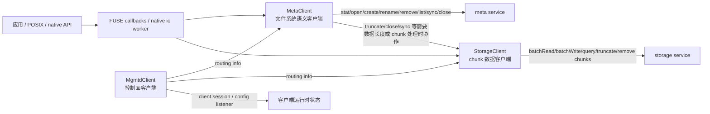
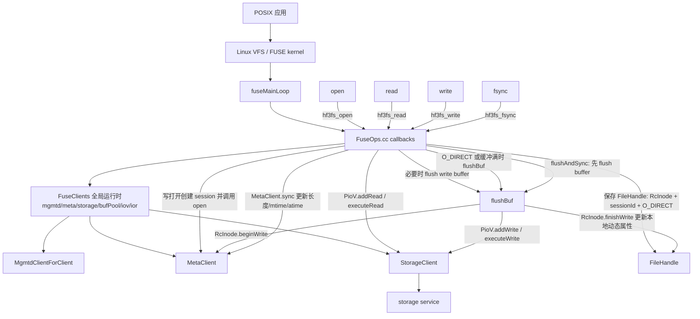

# 3FS Day 7 Reading Guide Answers

> 做完 [docs/day7-reading-guide.md](/data00/home/lujianhui.1/3FS/docs/day7-reading-guide.md:1) 里的阅读任务后再看这份参考产出。

## 阶段产出

### 阅读任务完成清单

- [x] 已读 `src/client/mgmtd/MgmtdClient.h`，确认它是 routing info、heartbeat、client session、配置监听等控制面入口。
- [x] 已读 `src/client/meta/MetaClient.h`，确认它承接 inode/path/session/权限/长度等文件系统语义。
- [x] 已读 `src/client/storage/StorageClient.h`，确认它承接 chunk 级 read/write/query/truncate/remove 等数据面操作。
- [x] 已读 `src/fuse/hf3fs_fuse.cpp` 和 `src/fuse/FuseApplication.*`，确认 FUSE 进程启动后进入 `FuseClients::init` 和 `fuseMainLoop`。
- [x] 已读 `src/fuse/FuseClients.*`，确认 FUSE 运行时持有 `MgmtdClientForClient`、`MetaClient`、`StorageClient`、`IovTable`、`IoRingTable` 和 io ring worker。
- [x] 已重点读 `src/fuse/FuseOps.cc` 的 `hf3fs_open/read/write/fsync/release`、`flushBuf`、`flushAndSync` 和虚拟 `iovs` 目录注册逻辑。
- [x] 已读 `src/lib/api/hf3fs_usrbio.h`、`src/lib/api/UsrbIo.cc`、`src/lib/api/UsrbIo.md`，确认 `Iov`、`Ior`、fd 注册、prep/submit/wait 的 native zero-copy 流程。

### 第一阶段：客户端职责边界图



`MgmtdClient` 是控制面入口，负责启动后台刷新、维护 routing info、管理 client session、监听服务端/客户端配置变化，并把路由变化分发给上层 client。它不表达文件系统语义，也不直接执行 chunk IO。

`MetaClient` 是文件系统语义入口，负责 `stat/open/create/close/sync/rename/remove/list/truncate` 这类 inode、路径、session、权限和文件长度相关操作。它主要访问 meta service，但在 close、sync、truncate 等场景会和 `StorageClient` 协作，让元数据语义和底层 chunk 状态对齐。

`StorageClient` 是数据面入口，负责把文件 layout 解析后的 chunk IO 发到 storage target，包括 `batchRead`、`batchWrite`、`queryLastChunk`、`removeChunks`、`truncateChunks` 等。它依赖 `MgmtdClient` 的 routing info 选择 chain/target/channel，但不关心路径名、权限、目录层级或 open/close 语义。

### 第二阶段：FUSE 路径链路图



启动路径上，`hf3fs_fuse.cpp` 或 `FuseApplication` 先加载配置、启动基础组件，再调用 `FuseClients::init`。`FuseClients::init` 创建 net client、`MgmtdClientForClient`、`StorageClient`、`MetaClient`，并启动 io ring worker、watcher 和 periodic sync 后台任务。

普通 FUSE 数据路径仍然经过内核 FUSE 边界：应用的 `open/read/write/fsync` 先进入 VFS/FUSE kernel，再回调到 `FuseOps.cc`。`open` 的写打开会向 meta 申请 file session；`read` 通过 `PioV` 组织 read IO 后交给 storage；`write` 可能先进入 FUSE 侧 write buffer，再由 `flushBuf` 写 storage；`fsync` 先刷出缓冲数据，再调用 `MetaClient::sync` 更新文件长度和时间戳等元数据。

### 第三阶段：FUSE 与 USRBIO 对比总结

FUSE 路径面向通用 POSIX 程序，应用只需要把 3FS 当普通挂载点使用，`open/stat/read/write/fsync/close` 都由内核 VFS 和 FUSE daemon 接住。它的优势是兼容性好、改造成本低；代价是每次请求要跨内核 FUSE 边界，读写数据还要经过 FUSE callback 和 daemon 侧缓冲处理，大 IO、批量 IO 和高并发训练场景容易被上下文切换、拷贝和单次 IO 限制拖慢。

USRBIO 是 native zero-copy 数据路径。应用通过 `hf3fs_iov` 创建或包装一块和 FUSE 进程共享的大内存区域，用它承载读写数据；通过 `hf3fs_ior` 创建小型共享 ring，把 IO 请求和完成结果放进 ring 中，FUSE 进程里的 watcher/worker 再批量取出请求并调用 `StorageClient`。这条路径绕开普通 FUSE read/write callback 的数据搬运方式，更适合大块、批量、异步、可改造应用代码的场景。

native API 仍然依赖 FUSE 进程，因为它不是独立的完整客户端进程。`hf3fs_iovcreate` 会在挂载点下的 `/3fs-virt/iovs` 创建 symlink 来注册共享内存，FUSE 侧负责解析这个虚拟目录、打开并登记 shm、做 IB memory registration，并维护 `IovTable`/`IoRingTable`。`hf3fs_prep_io` 使用已注册 fd 的 inode id 组织请求，但真正查 inode、查共享 buffer、批量提交 storage IO 的 worker 仍在 FUSE 进程中。

## 练习题参考答案

1. `MgmtdClient` 在客户端体系里主要提供什么能力？
   - `MgmtdClient` 主要提供控制面能力，包括拉取和刷新 routing info、建立和续约 client session、监听配置变化，以及把路由信息提供给 meta/storage client。它让数据面和元数据面不用每次请求都重新发现后端节点，而是基于同一份客户端侧路由视图工作。
   - 对 FUSE 进程来说，`MgmtdClientForClient` 还会把自己注册成 `NodeType::FUSE` 的 client session。这个 session 是后端识别客户端存活状态、配置下发和后续 session 清理的重要基础。

2. `MetaClient` 和 `StorageClient` 分别对应哪一段业务语义？
   - `MetaClient` 对应文件系统语义层，处理路径、inode、目录项、权限、文件 session、文件长度和时间戳等语义。像 `open/stat/create/rename/remove/list/sync/close` 这类操作的核心问题不是数据块读写，而是“这个文件系统对象是否合法、可见、可访问、状态如何变化”。
   - `StorageClient` 对应 chunk 数据层，处理 layout 映射后的 `ReadIO`、`WriteIO`、last chunk 查询、chunk truncate 和 remove。它面对的是 chain、target、routing version、IO buffer 和 checksum/retry 这类数据面问题，而不是路径名或 POSIX 目录语义。

3. 为什么客户端不能把所有操作都直接打到 storage？
   - storage 只保存和服务 chunk 数据，它不知道 `/a/b/c` 这种路径如何解析，也不知道目录权限、hard link、rename、open session、删除后延迟 GC 等文件系统语义。直接把所有请求打到 storage，会绕过 meta 对命名空间和一致性的控制。
   - 即使是读写数据，也需要先有 meta 提供的 inode layout、truncate version、文件长度和 session 语义。否则客户端无法判断某个 offset 对应哪个 chunk、是否越过文件洞、写入是否和 truncate/close/sync 并发冲突。

4. FUSE 路径里最明显的性能瓶颈是什么？
   - 最明显的瓶颈是应用和 FUSE daemon 之间的内核 FUSE 边界。普通 `read/write` 要从应用进入内核，再到用户态 FUSE 进程，FUSE 进程再组织到 storage 的网络 IO，路径上多了上下文切换、调度和数据搬运。
   - 另一个瓶颈是普通 POSIX IO 很难自然表达大批量异步请求。`FuseOps.cc` 里虽然用 write buffer、RDMA buffer pool 和 `PioV` 做优化，但入口仍然受 FUSE callback 模型约束；训练读取大 batch 或大块写入时，USRBIO 的共享 ring 更容易把请求合批提交。

5. `hf3fs_usrbio.h` 里的 `Iov` 和 `Ior` 分别在扮演什么角色？
   - `Iov` 是数据缓冲区角色，本质是一段用户进程和 FUSE 进程共享的大内存区域。读操作的数据会被 storage IO 写入 `Iov`，写操作也要求应用先把数据放进 `Iov`，FUSE 进程负责管理这段共享内存的注册和访问。
   - `Ior` 是请求队列角色，本质是一个共享内存 ring，作用类似简化的 io_uring。应用通过 `hf3fs_prep_io` 往 ring 里放请求，通过 `hf3fs_submit_ios` 提示 FUSE worker 处理，再通过 `hf3fs_wait_for_ios` 收完成结果；`Ior` 只传请求元数据和 CQE，不承载大块文件数据。

6. native zero-copy API 为什么仍然依赖 FUSE 进程？
   - 因为 native API 复用了 FUSE 进程里的挂载实例、client runtime、`StorageClient`、`IovTable` 和 `IoRingTable`。应用创建 `Iov/Ior` 时要通过挂载点下的 `/3fs-virt/iovs` 注册共享内存和 io ring，FUSE 进程负责把这些虚拟目录操作转成内部表项。
   - `hf3fs_prep_io` 只是在用户进程里把 fd、inode id、buffer id、offset、length 等信息写入 ring。真正消费 ring、查找 `RcInode` 和共享 buffer、合批调用 `StorageClient` 的逻辑运行在 FUSE 进程的 io ring worker 中，所以 FUSE daemon 仍然是 native 数据路径的执行者和资源管理者。

7. 为什么 `open/stat/close` 这类操作仍然保留在文件系统语义层，而不是完全下沉成裸数据 IO？
   - `open/stat/close` 处理的是文件对象状态，不只是数据块传输。`open` 需要权限和 session，`stat` 需要 inode 属性和可能的长度同步，`close` 需要结束写 session，并决定是否更新文件长度、mtime/atime 等元数据。
   - 如果把这些操作下沉成裸数据 IO，storage 层就必须理解 inode、目录、权限、session 和事务语义，等于把 meta 的职责复制到 storage。3FS 把语义留在 meta/FUSE 层，storage 专注 chunk IO，这样边界更清晰，也更容易维护一致性。

8. 什么时候一个应用更适合用 FUSE，什么时候更适合接 native API？
   - 如果应用希望零改造使用 POSIX 文件接口，或者它的 IO 不是极端大块、批量、高并发，FUSE 更合适。它能覆盖普通工具链、脚本、shell 命令和大多数已有程序，部署和调试成本最低。
   - 如果应用能改代码，并且主要瓶颈在大规模读写吞吐、批量提交、减少拷贝和减少 FUSE callback 开销，native USRBIO 更合适。典型例子是训练或数据加载程序：它可以提前申请 `Iov`，用多个 `Ior` 批量提交异步 IO，让 FUSE 进程直接从共享 ring 中取任务执行。

## Day 7 笔记模板补全

```md
# Day 7

## 客户端职责边界
- MgmtdClient: 控制面客户端，维护 routing info、client session 和配置监听。
- MetaClient: 文件系统语义客户端，负责 inode/path/session/权限/长度相关操作。
- StorageClient: chunk 数据客户端，负责 batch read/write、query/truncate/remove chunks 和 storage target 路由。

## 两条访问路径
- FUSE: 应用走 POSIX/VFS/FUSE callback，由 FUSE 进程调用 MetaClient 和 StorageClient。
- USRBIO: 应用用 Iov 共享数据缓冲区，用 Ior 共享请求 ring，FUSE 进程批量消费 ring 并调用 StorageClient。

## 闭环链路
- open: VFS -> hf3fs_open -> 写打开时 MetaClient.open 创建 session -> FileHandle 保存 RcInode/session。
- read: VFS -> hf3fs_read -> 必要时 flush 写缓冲 -> PioV.addRead/executeRead -> StorageClient。
- write: VFS -> hf3fs_write -> 写入 FUSE write buffer 或 O_DIRECT 直接 flushBuf -> beginWrite -> StorageClient.write -> finishWrite。
- fsync: VFS -> hf3fs_fsync -> flushAndSync -> flushBuf 刷数据 -> MetaClient.sync 更新长度和时间戳。

## 还不清楚的问题
- Q1: `PioV` 如何把文件 offset 精确拆成多个 chunk/chain 上的 `ReadIO` 和 `WriteIO`？
- Q2: USRBIO 的 io ring worker 如何在多 ring、多优先级之间保证公平和吞吐？
- Q3: FUSE write buffer、periodic sync、close 和 fsync 并发时，文件长度 hint 如何避免回退或重复同步？
```
